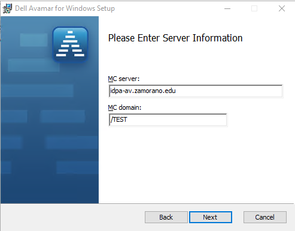
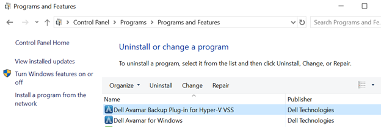
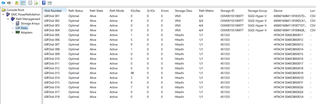
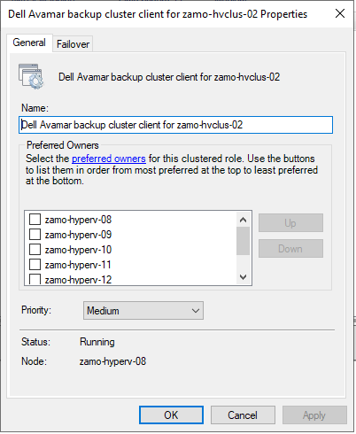
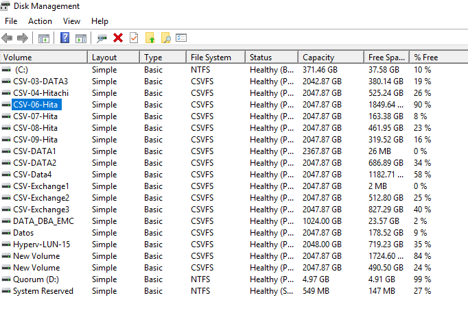
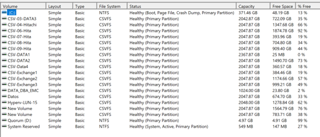

Informe de Mantenimiento de Infraestructura Hyper-V y Dell Avamar

Fecha de realización del mes de octubre del 2024 al mes de enero 2025

Infraestructura: Hyper-V con Avamar Dell Backup

Infraestructura: VMWare con Avamar Dell Backup

Introducción
En el contexto actual de la transformación digital y la creciente dependencia de infraestructuras virtualizadas, el mantenimiento preventivo y correctivo de los entornos Hyper-V se ha convertido en un aspecto crítico para garantizar la continuidad operativa de las organizaciones. El presente informe documenta las actividades de mantenimiento realizadas en una infraestructura Hyper-V que gestiona 74 máquinas virtuales (VMs) respaldadas por el sistema Avamar Dell, enfocándose en los procesos de consolidación y reconstrucción de máquinas virtuales para optimizar el rendimiento y garantizar la integridad de los datos, así como un upgrade de versión de máquina de virtual de 5.0, 8.0 a la última versión de Hyper-V que es la 9.0 y además de la depuración de LUNS para espacio disponible para nuevas Maquinas virtuales. 

Se realizo la actualización del cliente de Avamar de versión de 19.7 a 19.10 del agente y así poder llegar a los requerimientos mínimos de parte del proveedor. Se actualizo cada nodo de la infraestructura y se instaló sus plugins correspondientes, así como el usuario específico de active directory para el logeo de servicios.

Objetivo General
Ejecutar un proceso integral de mantenimiento en la infraestructura Hyper-V para optimizar el rendimiento del sistema, garantizar la integridad de los respaldos y mejorar la eficiencia operativa de las 74 máquinas virtuales gestionadas y depuración de LUNS.

Objetivos Específicos
1. Realizar la consolidación (merge) de snapshots en las máquinas virtuales para optimizar el espacio de almacenamiento y mejorar el rendimiento del sistema, estableciendo una línea base actualizada para cada VM.

2. Implementar procesos de reconstrucción selectiva en las VMs que presenten fragmentación o inconsistencias, asegurando su correcta operatividad y la integridad de los respaldos en Avamar Dell.

1. Resumen 
1.1 Respaldo con Avamar en Hyper-V y VMware:
Se implementó la solución de respaldo Avamar para entornos Hyper-V y VMware, con el objetivo de garantizar la protección de las máquinas virtuales (VMs). Para ambos entornos, se realizaron los siguientes pasos:
•	Para Hyper-V: Se configuró Avamar para realizar respaldos de las máquinas virtuales sin interrumpir su funcionamiento, utilizando la integración con VSS (Volume Shadow Copy Service). Este proceso permite obtener instantáneas consistentes de las VMs en funcionamiento, realizando respaldos completos e incrementales de las máquinas virtuales, lo que optimiza el tiempo y espacio de almacenamiento.
•	Para VMware: Avamar utiliza la vSphere API para gestionar los respaldos de las VMs. Se configuraron políticas de respaldo para garantizar que las máquinas virtuales se respaldaran de forma eficiente, con opciones para realizar respaldos completos o incrementales según las necesidades del entorno.
1.2. Actualización de Agentes Clientes en Windows Server y en Nodos de Hyper-V:
Para asegurar la correcta integración y funcionamiento del respaldo, se actualizó el agente cliente de Avamar en cada nodo de Windows Server y en los nodos de la infraestructura de Hyper-V. Este proceso incluyó:
•	Descarga e instalación de las versiones más recientes de los agentes.
•	Verificación de la compatibilidad de la versión del agente con los sistemas operativos y las configuraciones de Hyper-V y VMware.
•	Aseguramiento de que todos los nodos estuvieran correctamente conectados y configurados para la realización de respaldos sin fallos ni inconsistencias.
1.3. Consolidación de Discos:
Durante la consolidación de discos, se procedió a agrupar los discos virtuales y eliminar los discos huérfanos o no utilizados, con el fin de optimizar el espacio y la administración de almacenamiento en las máquinas virtuales. Este proceso mejora la eficiencia en el uso del almacenamiento y facilita la gestión de los recursos en el entorno virtualizado.
•	Se revisaron los discos asignados a las máquinas virtuales y se consolidaron aquellos que no estaban siendo utilizados.
•	También se gestionaron los discos que presentaban fallos de sincronización para evitar pérdidas de datos.
1.4. Depuración de LUNs en la SAN:
En la infraestructura de almacenamiento de área de red (SAN), se llevó a cabo un proceso de depuración de LUNs (Logical Unit Numbers). Esto incluyó:
•	Identificación y eliminación de LUNs llenos o poco utilizados para liberar espacio en la SAN.
•	Optimización de la distribución de las LUNs en los discos físicos para mejorar el rendimiento y la eficiencia en la gestión del almacenamiento.
•	Revisión de las configuraciones de acceso a LUNs y ajustes para garantizar que el almacenamiento estuviera correctamente asignado y optimizado.

2. Marco Teórico: Actualización del Cliente Avamar
2.1 Fundamentos de la Actualización del Cliente Avamar
La actualización del cliente Avamar constituye un componente crítico dentro del ciclo de vida de la gestión de respaldos en entornos virtualizados. El cliente Avamar, también conocido como Avamar Agent, es el software responsable de la comunicación entre las máquinas virtuales y el servidor Avamar central, facilitando la identificación, transferencia y deduplicación de datos a nivel de cliente.

Los principales aspectos que justifican un proceso periódico de actualización del cliente Avamar incluyen:

2.1.1 Seguridad y Cumplimiento**: Las nuevas versiones del cliente incorporan parches de seguridad que protegen contra vulnerabilidades conocidas, asegurando que la solución de respaldo no represente un vector de ataque en la infraestructura.

2.1.2 Compatibilidad: Cada actualización garantiza la compatibilidad con las últimas versiones de sistemas operativos, aplicaciones y plataformas de virtualización como Hyper-V, especialmente relevante en entornos heterogéneos.

2.1.3 Rendimiento: Las actualizaciones suelen incorporar mejoras en algoritmos de deduplicación, compresión y transmisión de datos, resultando en respaldos más rápidos y eficientes.

2.1.4. Nuevas Funcionalidades: Versiones más recientes implementan capacidades adicionales como respaldo de nuevas aplicaciones, métodos mejorados de verificación o integración con otras soluciones.

2.2 Arquitectura del Cliente Avamar en Entorno Hyper-V

En un entorno Hyper-V, la arquitectura de implementación del cliente Avamar puede seguir dos enfoques principales:

2.2.1 Enfoque Basado en Host
Utiliza el Avamar VADP (vStorage APIs for Data Protection) que se instala en el servidor Hyper-V host. Este enfoque:
- Permite respaldos a nivel de imagen sin agentes en las VM
- Facilita la gestión centralizada desde el servidor host
- Minimiza la sobrecarga en máquinas virtuales individuales
- Aprovecha características de Hyper-V como VSS para consistencia

2.2.2 Enfoque Basado en Guest
Requiere la instalación del agente Avamar dentro de cada máquina virtual. Este método:
- Proporciona respaldos granulares a nivel de aplicación
- Permite políticas específicas por máquina virtual
- Es necesario para aplicaciones que requieren consistencia interna
- Facilita la recuperación a nivel de archivo o aplicación

2.3 Proceso de Actualización del Cliente Avamar

El proceso de actualización sigue una metodología estructurada que minimiza el impacto en la disponibilidad del servicio:

2.3.1 Fase de Preparación
2.3.1.1 Evaluación de Compatibilidad: Verificación de compatibilidad entre la nueva versión del cliente y los sistemas operativos de las VMs
2.3.1.2. Inventario de Clientes: Documentación de versiones actuales y planificación de secuencia de actualización
3. Ventanas de Mantenimiento: Establecimiento de períodos de baja actividad para la actualización
4. Respaldo Preventivo: Ejecución de respaldos completos pre-actualización

2.3.2 Fase de Implementación
2.3.2.1. Actualización por Grupos: Organización de VMs en grupos de similares características para actualizaciones escalonadas
2.3.2.2. Método de Despliegue:
   - Push automático desde el servidor Avamar (recomendado para grandes entornos)
   - Instalación manual para casos específicos
   - Despliegue mediante herramientas de gestión como SCCM
2.3.2.3. Verificación de Instalación: Confirmación de versión correcta y servicios en ejecución

2.3.3 Fase de Validación
2.3.3.1. Pruebas Funcionales: Ejecución de respaldos de prueba post-actualización
2.3.3.2. Verificación de Conectividad**: Confirmación de comunicación correcta con el servidor Avamar
2.3.3.3. Validación de Rendimiento**: Comparativa de tiempos y eficiencia de respaldo pre/post actualización

2.4 Consideraciones Específicas para Entorno Hyper-V
La actualización del cliente Avamar en entornos Hyper-V presenta consideraciones particulares:
2.4.1. Integración con VSS (Volume Shadow Copy Service): Verificación de compatibilidad con la versión de Hyper-V para garantizar snapshots consistentes

2.4.2. CBT (Changed Block Tracking): Confirmación de que la funcionalidad de seguimiento de bloques modificados permanece operativa tras la actualización

2.4.3. Respaldos Activos: Gestión de trabajos de respaldo activos durante el proceso de actualización

2.4.4. Alta Disponibilidad (HA): Consideraciones especiales para VMs en configuraciones de clúster Hyper-V 

2.4.5. Modo de Proxy: Verificación de configuraciones de proxy si se utiliza para optimizar el tráfico de respaldo

2.5 Mejores Prácticas en la Actualización del Cliente Avamar

2.5.1. Actualización Incremental: Preferir actualizaciones graduales en vez de saltos de múltiples versiones

2.5.2. Documentación Detallada: Mantener registros completos de versiones, configuraciones y problemas encontrados

2.5.3. Entorno de Pruebas: Validar actualizaciones en un subconjunto representativo de VMs antes del despliegue general

2.5.4. Sincronización con Avamar Server: Garantizar compatibilidad entre versiones de cliente y servidor

2.5.5. Plan de Rollback: Establecer procedimientos claros para revertir a versiones anteriores en caso de incompatibilidad

3. Metodología 
3.1. Fundamentos de la Metodología de Backups con Avamar
Avamar implementa metodologías especializadas para cada plataforma de virtualización, aprovechando las APIs nativas y características específicas de Hyper-V y VMware, mientras mantiene sus principios fundamentales de deduplicación global y respaldo eficiente.

3.1.1 Principios Comunes
- Deduplicación global a nivel de variable: Identifica segmentos de datos únicos a través de todas las VMs
- Compresión avanzada: Reduce el volumen de datos a transferir y almacenar
- Cifrado en reposo y en tránsito: Garantiza la seguridad de los datos en todo momento
- Validación automática: Verifica la integridad de los respaldos

3.2. Metodología para Hyper-V
3.2.1 Arquitectura de Respaldo en Hyper-V
3.2.1.1 Respaldo a Nivel de Host (Image-Level Backup)
- Tecnología base: Utiliza Microsoft VSS (Volume Shadow Copy Service)
- Componentes clave:
  - Avamar Hyper-V VSS Requestor: Coordina el proceso de backup
  - Avamar Hyper-V VSS Writer: Facilita la creación de snapshots consistentes
  - Avamar Proxy: Gestiona la transferencia de datos

3.2.1.2 Respaldo a Nivel de Guest (File-Level Backup)
- Instalación de agentes Avamar en cada VM
- Coordinación mediante servicios de cliente Avamar
- Soporte para respaldos granulares de aplicaciones (SQL, Exchange, etc.)

3.2.2 Proceso Metodológico en Hyper-V

3.2.2.1. Fase de Descubrimiento:
   - Identificación automática de VMs mediante WMI (Windows Management Instrumentation)
   - Clasificación según políticas establecidas

3.2.2.2. Fase de Preparación:
   - Coordinación con VSS para garantizar consistencia
   - Quiescencia de aplicaciones si es necesario

3.2.2.3. Fase de Ejecución:
   - Creación de snapshot VSS
   - Lectura de datos modificados (CBT cuando disponible)
   - Transferencia mediante deduplicación en cliente

3.2.2.4. Fase de Finalización:
   - Verificación de integridad
   - Liberación de snapshots
   - Actualización de metadatos

3.2.3 Características Específicas de Hyper-V
- Soporte para Windows Server 2012 R2 y superiores
- Integración con System Center
- Respaldo de VMs en clúster de conmutación por error
- Soporte para Storage Spaces Direct

3.3. Metodología para VMware
3.3.1 Arquitectura de Respaldo en VMware
3.3.1.1 Respaldo Basado en VADP (vStorage APIs for Data Protection)
- Componentes clave:
  - Avamar Proxy: Máquinas virtuales dedicadas para gestionar transferencias
  - vCenter Server: Punto central de gestión
  - Avamar VMware Image Plugin: Integración con vSphere

3.3.1.2 Métodos de Acceso a Datos
3.3.1.2.1. HotAdd: 
   - Monta discos virtuales temporalmente en proxies virtuales
   - Optimiza transferencia dentro del mismo host

3.3.1.2.2. NBDSSL:
   - Transferencia cifrada sobre red IP
   - Independiente de la ubicación del almacenamiento

3.3.1.2.3. SAN: 
   - Acceso directo al almacenamiento compartido
   - Elimina carga de red de producción

3.3 Proceso Metodológico en VMware

3.3.1. Fase de Descubrimiento:
   - Consulta a vCenter para identificar VMs
   - Selección automática según políticas

3.3.2. Fase de Preparación:
   - Selección del mejor método de transporte (HotAdd/NBDSSL/SAN)
   - Coordinación con VMware Tools para quiescencia si es necesario

3.3.3. Fase de Ejecución:
   - Creación de snapshot VMware
   - Lectura de bloques mediante CBT (Change Block Tracking)
   - Procesamiento por proxy y transferencia deduplicada

3.3.4. Fase de Finalización:
   - Consolidación de snapshot
   - Verificación de consistencia
   - Catalogación de VMs y contenido

3.4 Características Específicas de VMware
- Soporte para vSphere 6.0 y superiores
- Integración con vCenter Server
- Compatibilidad con vSAN y NSX
- Recuperación granular de archivos

4. Procedimientos Realizados
4.1 Instalación de Cliente de Avamar en los Nodos
4.1.1 AvamarClient-windows-x86_64-19.10.100-135.msi
a.	Plugins->Avamar Client User Interface
b.	Mc server: idpa-av.zamorano.edu
c.	MC domain: /TEST

 

4.1.2 Creación de reglas de entrada en el firewall de cada nodo:
Firewall Inbounds
	Port
o	TCP
	Specific local ports: 29000, 28001, 28002, 30001, 30002, 30003
•	Allow the connection
o	Domain
	Name: Avamar Client

4.1.3 Servicios 
Servicio en ejecución llamado Dell Avamar Plug-in Service for Windows, con usuario de active directory con las siguientes credenciales:
LOG ON
	avamarbackupuser@zamorano.edu
	avamarbackupuser
	Z@morano10*

4.2 Instalación de Hyper-V VSS de Avamar en los Nodos

4.3 Creación de rol en el cluster de hyper-v para manejo de todas las VM en el cliente de avamar:

4.4 Optimización de Almacenamiento SAN
4.4.1 Almacenamiento primario de la SAN
Documentación de los espacios de almacenamiento para liberar espacio de la SAN.

 
LUN
ITEM	NAME LUN	FREE SPACE	TOTAL DISK	Disk	Volume	% FREE
1	CSV-03-DATA3	380.14 GB	2042.87 GB	Disk 2	Volume 2	19%
2	CSV-04-HITACHI	525.24 GB	2042.87 GB	Disk 9	Volume9	26%
3	CSV-06-HITA	1849.64 GB	2042.87 GB	Disk 8	Volume8	90%
4	CSV-07-HITA	162.38 GB	2042.87 GB	Disk 5	Volume5	8%
5	CSV-08-HITA	461.95 GB	2042.87 GB	Disk 4	Volume4	23%
6	CSV-09-HITA	319.52 GB	2042.87 GB	Disk 12	Volume12	16%
7	CSV-DATA1	26 MB	2367.87 GB	Disk 11	Volume11	0%
8	CSV-DATA2	686.89 GB	2042.87 GB	Disk 7	Volume7	34%
9	CSV-DATA4	1182.71 GB	2042.87 GB	Disk 14	Volume14	58%
10	CSV-EXCHANGE1	2 MB	2042.87 GB	Disk 1	Volume 1	0%
11	CSV-EXCHANGE2	512.80 GB	2042.87 GB	Disk 15	Volume15	25%
12	CSV-EXCHANGE3	827.29 GB	2042.87 GB	Disk 6	Volume6	40%
13	DATA_DBA_EMC	23.57 GB	1024.00 GB	Disk 17	Volume18	2%
14	DATOS	178.52 GB	2042.87 GB	Disk 3	Volume3	9%
15	HYPERV-LUN-15	719.23 GB	2042.87 GB	Disk 16	Volume16	35%
16	NEW VOLUME	1724.60 GB	2042.87 GB	Disk 10	Volume10	84%
17	NEW VOLUME	490.50 GB	2042.87 GB	Disk 13	Volume13	24%
18	QUORUM	4.91 GB	4.97 GB	QUORUM		99%

4.4.2 Almacenamiento final de la SAN

LUN		
ITEM	NAME LUN	FREE SPACE	TOTAL DISK	Disk	Volume	% FREE
1	CSV-03-DATA3	722.09 GB	2042.87 GB	Disk 2	Volume 2	35%
2	CSV-04-HITACHI	1347.68 GB	2042.87 GB	Disk 9	Volume9	66%
3	CSV-06-HITA	1874.78 GB	2042.87 GB	Disk 8	Volume8	92%
4	CSV-07-HITA	393.96 GB	2042.87 GB	Disk 5	Volume5	19%
5	CSV-08-HITA	704.80 GB	2042.87 GB	Disk 4	Volume4	34%
6	CSV-09-HITA	909.40 GB	2042.87 GB	Disk 12	Volume12	44%
7	CSV-DATA1	25 MB	2367.87 GB	Disk 11	Volume11	0%
8	CSV-DATA2	1490.70 GB	2042.87 GB	Disk 7	Volume7	73%
9	CSV-DATA4	360.57 GB	2042.87 GB	Disk 14	Volume14	18%
10	CSV-EXCHANGE1	384.46 GB	2042.87 GB	Disk 1	Volume 1	19%
11	CSV-EXCHANGE2	1174.66 GB	2042.87 GB	Disk 15	Volume15	57%
12	CSV-EXCHANGE3	999.21 GB	2042.87 GB	Disk 6	Volume6	49%
13	DATA_DBA_EMC	23.80 GB	1024.00 GB	Disk 17	Volume18	2%
14	DATOS	674.70 GB	2042.87 GB	Disk 3	Volume3	33%
15	HYPERV-LUN-15	1278.84 GB	2042.87 GB	Disk 16	Volume16	62%
16	NEW VOLUME	1564.79 GB	2042.87 GB	Disk 10	Volume10	76%
17	NEW VOLUME	783.71 GB	2042.87 GB	Disk 13	Volume13	38%
18	QUORUM	4.91 GB	4.97 GB	QUORUM		99%

 

4.4.3 Creación de servidor de respaldo
- Se creó un servidor nuevo con hostname zamo-bk-02 para backup de VMs de la infraestructura de Hyper-V.
 
- Se respaldó las VM en un servidor local con hostname: zamo-bk-01 antes de realizar la consolidación de discos.
 
- Se documentó: información del sistema, roles de servidor, servicios, programas instalados, usuarios y todos los recursos que operan el en Sistema Operativo (SO).
 
- Se documento el usuario Administrador (Local) de cada VM para inicio de sesión luego de reconstrucción de VM.
 
- Se documentó configuraciones (Settings) para las especificaciones requeridas al momento de reconstrucción de VMs.
 
- Se documentó la Generación de la máquina virtual Generación 1 o Generación 2 para el momento de arranque.
 
-Se documento la configuración IPV4 de la tarjeta de red (Network adapter) para volver a ingresar la VM al dominio con el mismo host.
 
- Se ejecutó un proceso de consolidación de snapshots obsoletos (también conocidos como huérfanos)
 

-	Se identificaron los parent de cada maquina virtual para el momento de consolidación 
 
- Se implementó una limpieza de archivos temporales y logs innecesarios
 
- Se realizó la compactación de VHDx para recuperar espacio no utilizado
 
- Se identificaron y eliminaron máquinas virtuales obsoletas, de las cuales se hizo previa validación de uso y así liberar espacio en disco de la SAN y recursos como CPU y Memoria de la infraestructura.
 
 
4.2 Problemas presentados
-	Error de dispositivo de arranque inaccesible (inaccesible boot device) en el Sistema operativo luego de la reconstrucción 
-	Error de configuración de Asistente de configuración de cluster de Avamar
 
-	Error de consolidación en VMs con replicación en Azure perdiendo su Identy (Identidad)
 
 
-	Perdida de agente de monitoreo de para VMS (LogRythm)
 
-	Error de consolidación de discos pendiente al momento de inspeccionar
 

4.3 Soluciones
-	Arrancar la VM en modo bueno único de Windows para Generación 2 (Generación 1 no existe)
-	Se consolidó las VMs con replicación hasta su último Parent, luego una reconstrucción de VM y dejando la máquina virtual vieja como respaldo.
-	Se instaló de nuevo el agente de LogRhythm (System monitor configuration manager) en zamo-rrhh-03 y zamo-dev-01 para monitoreo. 

4.4 Tareas Pendientes
- Programar una ventana de mantenimiento para respaldo y reconstrucción de VMs zamo-acad-01, zamo-acad-02, zamo-acad-03 y zamo-acad-04.

Resultados Obtenidos

Registro de Tiempos de Consolidación y Reconstrucción de VMs
Nombre VM	Tamaño Anterior (GB)	Tamaño Posterior (GB)	Tiempo Consolidación (hrs)	Tiempo Reconstrucción (hrs)	Estado Final
Comedorbio	51.3 GB	39.3 GB	40 min	20 min	Operativo
Zamo-app-01	150 GB	137 GB	4 horas	10 min	Operativo
Zamo-app-02	101 GB	43.1 GB	1 hora y
20 min	20 min	Operativo
	50 GB	52 GB	1 hora y
20 min		
Zamo-app-03	127 GB	127 GB	0 min	20 min	Operativo
	100 GB	100 GB	0 min		
Zamo-app-04	401 GB	401 GB	12 horas	30 min	Operativo
Zamo-app-06	49 GB	49 GB	3 horas y 10 min	30 min	Operativo
	184 GB	184 GB			
zamo-appagr-d01	45.7 GB	45.7 GB	8 horas y 40 min	20 min	Operativo
	2.03 GB	2.03 GB			
zamo-appagr-p01	47.6 GB	47.6 GB	1 hora 40 min	20 min	Operativo
	250 GB	250 GB			
zamo-appmalezas-01	20.5 GB	20.5 GB	1 hora 40 min	20 min	Operativo
Zamo-audit-01	99.9GB	99.9GB	0 min	20 min	Operativo
	400 GB	400 GB			
Zamo-aurea-01	48.69 GB	51.6 GB			Operativo
Zamo-av-01	51.49 GB	56.44 GB	50 min	10 min	Operativo
zamo-bwp-03	93.85 GB	93.85 GB	6 horas 40 min	20 min	Operativo
Zamo-db-01	122.91 GB	122.91 GB	40 min	20 min	Operativo
	1 TB	1 TB			
Zamo-db-03	57.47 GB	57.35 GB	13 horas y 30 min	30 min	Operativo
	130 GB	130 GB			
Zamo-dc-03	53.91 GB	53.91 GB	3 horas	16 min	Operativo
	2 GB	2 GB			
Zamo-desk-01					
zamo-dba-rrhh01					
zamo-dev-01					
zamo-dev-02					
zamo-dns-03					
zamo-dns-04_new					
zamo-dspace-03					
zamo-file-01					
zamo-ias-01					
zamo-ias-02					
zamo-ias-03					
zamo-ias-04					
zamo-ias-06					
zamo-intune-01					
Zamo-it-01					
zamo-koha-02					
zamo-mobile					
zamo-mproyectores-01					
zamo-mqm-01					
zamo-ov-01					
zamo-paco-01					
zamo-pagosabss					
zamo-pf-01					
zamo-pf-03					
zamo-prtg-01					
zamo-rm-01					
zamo-rms-02					
zamo-rras-01					
zamo-rras-02					
zamo-rras-03					
zamo-rrhh-01	186.94				
	700				
	700				
zamo-rrhh-02	103.04				
zamo-rrhh-03	93.07				
zamo-rrhh-04	49.79				
zamo-rs-01	108.38				
	400				
zamo-sccm-01	119.69				
	38.85				
zamo-scdw-01	69.79				
	111.19				
zamo-scom-02	72.35				
	27.63				
zamo-scsm-01	61.97				
zamo-scss-01	99				
zamo-smith-02	98.32				
zamo-smtp-01	63.41				
zamo-smtp-02	18.19				
zamo-sync-01	18				
zamo-sync-02	83.88				
zamo-tddb-01	48.22				
	9.75				
zamo-tdweb-01	111.04				
zamo-visitas-01	38.25				
zamo-web-01	117.32 				
	2.22 TB				
	483.63				
zamo-web-05	100.82				
zamo-wsus-01	452 MB				
	93.29				

El estado final incluye:
1.	Operativo: La VM funciona correctamente después del mantenimiento, con todos los servicios y aplicaciones funcionando según lo esperado.
2.	Degradado: La VM está funcionando, pero con algunas limitaciones o problemas menores que no afectan su operación principal.
3.	Con Pendientes: El proceso se completó, pero quedan tareas menores por realizar en una ventana de mantenimiento futura.
4.	Fallido: No se pudo completar el proceso de consolidación o reconstrucción satisfactoriamente, requiriendo acciones adicionales.
5.	Optimizado: No solo funciona correctamente, sino que muestra mejoras significativas en rendimiento o uso de recursos.
6.	En Monitoreo: El proceso se completó, pero la VM requiere seguimiento cercano para verificar estabilidad.
7.	Migrado: La VM se reconstruyó en otra ubicación o storage.
8.	Consolidado Parcial: Solo se completó parte del proceso de consolidación debido a alguna limitación.

4.5 Implementación de Políticas de Respaldo Avamar
Se establecieron las siguientes políticas de respaldo para la infraestructura de Hyper-V y VMWare siguiendo las mejores prácticas:

4.5.1 Políticas de Tamaño:
- Límite máximo por VM individual: 2TB
- Segmentación de respaldos para VMs mayores a 2TB
- Agrupación de múltiples VMs pequeñas, de acuerdo a grupo (RRHH, Dase de datos, APP y otros) hasta alcanzar 2TB por trabajo de respaldo.

4.5.2 Estrategias de Respaldo:
- Implementación de respaldos incrementales y completos diarios
- Respaldos completos semanales en horarios de bajo impacto
- Rotación de 15, 30 y 60 días para retención de datos
- Verificación automática de integridad post-respaldo

4.5.3 Ventanas de Respaldo:
- Distribución escalonada de trabajos para optimizar el rendimiento
- Priorización de VMs críticas en horarios de menor carga
- Monitoreo activo de tiempos de ejecución y uso de recursos.

4.6 Resultados Inmediatos
- Espacio recuperado en SAN: 6 TB
- Reducción en tiempos de respaldo: Tiempo transcurrido (Elapsed) de 6 horas a 3 horas máximas
- Optimización en el uso de recursos de red
- Asignacion de recuros de CPU y RAM a VMs Criticas: zamo-db-10 y otras.
- Mejora en la eficiencia de reduplicación de snapshots fallidos.
- Reconstrucción de VMs con Checkpoints en Producción no Standard

4.7 Beneficios Operativos
- Mayor predictibilidad en la gestión del almacenamiento
- Reducción en el tiempo de recuperación ante incidentes
- Mejor aprovechamiento de los recursos de infraestructura
- Cumplimiento de SLAs (Acuerdo de Nivel de Servicio) de respaldo y recuperación.

Conclusiones

1. La ejecución del mantenimiento ha resultado en una optimización significativa del espacio de almacenamiento y una mejora en el rendimiento general del sistema, evidenciado por la reducción en los tiempos de respuesta de las VMs y la eliminación exitosa de snapshots obsoletos que consumían recursos innecesarios.

2. La implementación de los procesos de consolidación y reconstrucción ha establecido una base sólida para la gestión futura de la infraestructura, permitiendo un mejor aprovechamiento de los recursos de Avamar Dell y facilitando los procesos de respaldo y recuperación de las máquinas virtuales.

Referencias Bibliográficas
https://www.delltechnologies.com/asset/en-us/products/data-protection/technical-support/docu89876.pdf
https://learn.microsoft.com/en-us/system-center/dpm/back-up-hyper-v-virtual-machines?view=sc-dpm-2025
El respaldo de Hyper-V de la VM indica el mensaje de error "Virtual machine does not have valid vhd chains and will not be backed up with image level backup" | Dell Perú
https://www.dell.com/support/manuals/en-us/avamar-server/avamar_administration_guide_19.10/?guid=guid-d9b4d125-2026-4860-b6e2-44ea3b537582&lang=en-us
